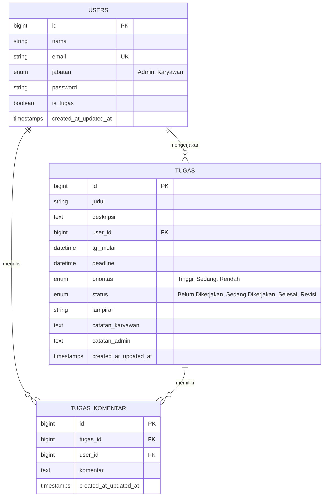

<h1 align="center">📋 Sistem Informasi Manajemen Tugas Karyawan (M-TUGAS)</h1>

<p align="center">
  
  
  
</p>

<p align="center">
  Aplikasi <b>Manajemen Tugas Karyawan (M-TUGAS)</b> berbasis <b>Laravel 11</b> yang dirancang untuk membantu pengawasan, pembagian, pengoperasian, serta pelaporan tugas pekerjaan antar <b>Admin</b> dan <b>Karyawan</b> secara efisien, terstruktur, dan berbasis peran (<i>role-based</i>).
</p>

---

## ✨ Fitur Utama Sistem

### 🔐 1. Keamanan & Autentikasi Solid
- **Login & Logout Aman**: Menggunakan sistem autentikasi bawaan yang dienkripsi dengan *Bcrypt Hash*.
- **Middleware Proteksi (`checkLogin` & `checkRole`)**: Menjamin hanya pengguna dengan hak akses yang tepat yang dapat membuka halaman tertentu.

### 🛡️ 2. Pemisahan Hak Akses (Role-Based)
- 👑 **Admin**:
  - Kontrol penuh atas Data Karyawan (CRUD).
  - Mendelegasikan, mengedit, dan menghapus tugas.
  - Memantau progres dan performa penyelesaian tugas karyawan.
- 🧑‍💻 **Karyawan**:
  - Hanya dapat melihat tugas yang ditugaskan khusus untuk dirinya.
  - Memperbarui status pekerjaan (`Belum Dikerjakan`, `Sedang Dikerjakan`, `Selesai`).
  - Melampirkan bukti hasil pekerjaan.
  - Berdiskusi via kolom komentar.

### 🤖 3. Otomatisasi Status Karyawan (Real-time)
- Kolom `is_tugas` pada sistem akan mendeteksi beban kerja karyawan secara dinamis:
  - 🔴 **Sudah Ditugaskan**: Karyawan memiliki minimal satu tugas aktif/revisi.
  - 🟢 **Available / Bebas Tugas**: Karyawan sedang menganggur (semua tugas selesai).

### 📊 4. Papan Kanban & Dashboard Interaktif
- **Statistik Cerdas**: Pantau jumlah total pengguna, karyawan sibuk vs *available*, serta tugas selesai vs proses.
- **Kanban Board**: Drag & Drop atau pantau aliran tugas divisualisasikan dalam 4 pilar (*Belum Dikerjakan, Sedang Dikerjakan, Revisi, Selesai*).
- **Filter Lanjutan**: Cari berdasarkan Karyawan, Prioritas, Status, dan Rentang Waktu.

### ⏰ 5. Peringatan Batas Waktu (Deadline Alert)
Dilengkapi dengan sistem indikator warna cerdas:
- 🔴 **Overdue (Terlewat)**: Tugas belum selesai dan melewati batas waktu.
- 🟡 **Mendekati Deadline**: Sisa waktu kurang dari 24 jam!
- 🟢 **Tepat Waktu**: Masih dalam masa aman atau sudah selesai.

### 💬 6. Ruang Diskusi & Lampiran Berkas
- **Upload Berkas**: Dukungan upload lampiran/bukti (JPG, PNG, PDF, ZIP, RAR, DOCX) hingga 10MB.
- **Komentar & Catatan Revisi**: Mudahkan komunikasi dua arah antara Admin dan Karyawan tanpa aplikasi pihak ketiga.

### 📄 7. Pelaporan (Export)
- 🖨️ **Export PDF**: Unduh laporan rekapitulasi siap cetak.
- 📊 **Export Excel/CSV**: Ekspor rekap data untuk olah data lebih lanjut.

---

## 📸 Tampilan Antarmuka (Screenshots)

*(Tambahkan tangkapan layar antarmuka aplikasi di folder `public/images/` dan perbarui tautan di bawah ini)*

| Dashboard Admin | Kanban Board Karyawan |
| :---: | :---: |
|  |  |

---

## 🔑 Akun Uji Coba (Demo Credentials)

Gunakan kredensial *dummy* berikut setelah Anda menjalankan seeder:

| Peran (Role) | Email | Password | Nama |
| :--- | :--- | :--- | :--- |
| 👑 **Admin** | `huda@gmail.com` | `1234` | samsul |
| 🧑‍💻 **Pegawai 1** | `pegawai@gmail.com` | `1234` | huda |
| 🧑‍💻 **Pegawai 2** | `karyawan@gmail.com` | `1234` | samsul huda |

---

## 🚀 Panduan Instalasi (Local Development)

Ikuti langkah-langkah berikut untuk menguji coba aplikasi secara lokal:

### 1. Kloning Repositori & Instalasi Dependensi
```bash
git clone https://github.com/username-anda/m-tugas-laravel.git
cd m-tugas-laravel
composer install
npm install && npm run build
```

### 2. Konfigurasi Environment (`.env`)
Salin file konfigurasi bawaan dan hasilkan *Application Key*:
```bash
cp .env.example .env
php artisan key:generate
```
Sesuaikan koneksi database di file `.env` Anda:
```env
DB_CONNECTION=mysql
DB_HOST=127.0.0.1
DB_PORT=3306
DB_DATABASE=db_manajemen_tugas
DB_USERNAME=root
DB_PASSWORD=
```

### 3. Migrasi Database & Seeder
Buat database `db_manajemen_tugas` di MySQL, lalu jalankan perintah:
```bash
php artisan migrate:fresh --seed
```
*(Jangan lupa juga menjalankan `php artisan storage:link` untuk menampilkan gambar/lampiran dengan benar)*

### 4. Jalankan Aplikasi
```bash
php artisan serve
```
Buka browser Anda dan akses: **👉 http://127.0.0.1:8000**

---

## 🗄️ Skema Database (ERD)



---

## 📁 Struktur Direktori Penting

```text
├── app/
│   ├── Http/Controllers/     # Controller (Auth, Dashboard, Tugas, User)
│   ├── Http/Middleware/      # Middleware (checkLogin, CheckRole)
│   └── Models/               # Model Database (User, Tugas, TugasKomentar)
├── database/
│   ├── migrations/           # Skema tabel
│   └── seeders/              # Data dummy (Admin & Karyawan)
├── resources/
│   └── views/
│       ├── auth/             # Antarmuka Login
│       ├── layouts/          # Template Utama & Sidebar
│       ├── admin/tugas/      # Halaman Manajemen Tugas & Kanban
│       └── admin/user/       # Halaman Kelola Karyawan
└── routes/
    └── web.php               # Konfigurasi Routing
```

---

<p align="center">Dibuat dengan ❤️ menggunakan <b>Laravel 11</b> untuk mempermudah operasional perusahaan Anda.</p>
